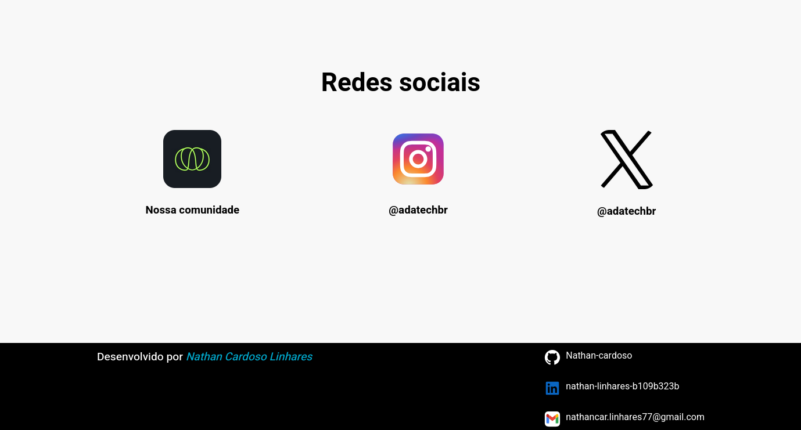
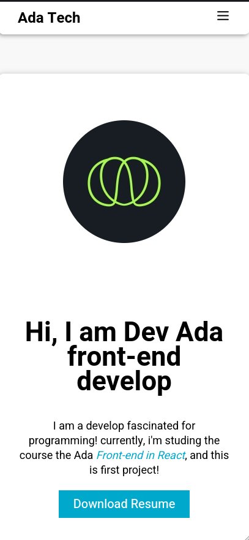
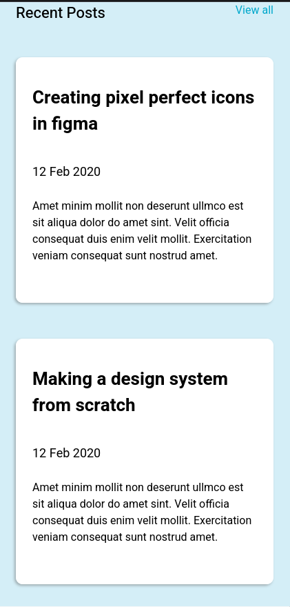
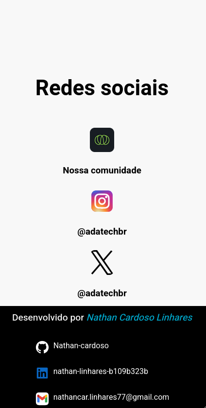

# Blog WEB

Este é o primeiro projeto da minha trilha de estudos sobre o framework React. O objetivo é criar uma página estática para praticar os conceitos básicos de HTML e CSS. O projeto consiste em replicar um blog pessoal inspirado em um design do Figma, com o foco em seguir fielmente o layout proposto, tanto para a versão desktop quanto para a versão mobile.

## Visualização da página

- **Home**: Exibe um texto dizendo quem é o autor do bloge sua imagem;
- **Post**: Exibe os últimos posts do autor;
- **Contact**: Exibe as redes sociais do autor.

## Versão Desktop

## Home

  

## Posts

  

## Contact

  

## Versão Mobile

## Home

  

## Posts

  

## Contact

  

Este projeto simples me permitiu revisar conceitos de HTML e CSS, além de trabalhar com a responsividade, tornando a experiência em múltiplas telas uma parte fundamental do meu aprendizado. Em projetos futuros, pretendo avançar para o uso de JavaScript, e em seguida, começar a aplicar React.

## Equipe

<table align="center">
  <tr>
    <td>
      <a href="https://github.com/Nathan-cardoso">
         
        
          <b>Nathan Cardoso</b>
        
      </a>
    </td>
    <td>

  </tr>
</table> 
